# seya_emoji

[@oti](https://github.com/oti)さんの [slack-reaction-decomoji](https://github.com/oti/slack-reaction-decomoji) を参考に作成しました。

ご自由にお使いください。

## 絵文字・標準語訳

 - せやで (そうだよ) 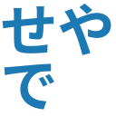
 - せやかて (そうはいっても) 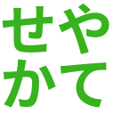
 - せやけど (そうだけど) 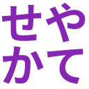
 - せやな (そうだね) 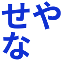
 - せやしな (だからな) 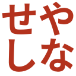
 - せやせや (そうそう) 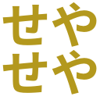
 - せやろ (そうだろ) 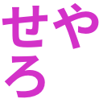
 - せやねん (そうだよね) 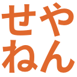
 - せやろか (そうだろうか) 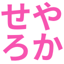
 - せや！ (そう！) 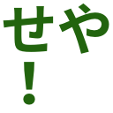
 - せやった (そうだった) 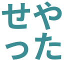
 - せやろな (そうだろうね) 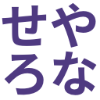
 - せやもん（そうだもん） 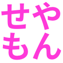
 - せやから（そうだから） 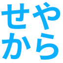

## 履歴

1. 2016-12-22 せやろな 追加
2. 2017-01-12 せやもん 追加
3. 2017-01-12 せやから 追加