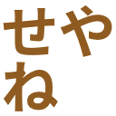

# seya_emoji

[@oti](https://github.com/oti)さんの [slack-reaction-decomoji](https://github.com/oti/slack-reaction-decomoji) を参考に作成しました。

ご自由にお使いください。

## 絵文字・標準語訳

|絵文字|テキスト|標準語訳|
|----|----|----|
||せやで|そうだよ|
||せやかて|そうはいっても|
||せやけど|そうだけど|
||せやな|そうだね|
||せやなあ|そうだねえ|
||せやしな|だからな|
||せやせや|そうそう|
||せやろ|そうだろ|
||せやねん|そうなんだよね|
||せやね|そうだね|
||せやろか|そうだろうか|
||せや！|そう！|
||せやった|そうだった|
||せやろな|そうだろうね|
||せやもん|そうだもん|
||せやから|そうだから|

## 履歴

1. 2016-12-22 せやろな 追加
2. 2017-01-12 せやもん 追加
3. 2017-01-12 せやから 追加
4. 2017-03-01 せやね / せやなあ 追加
